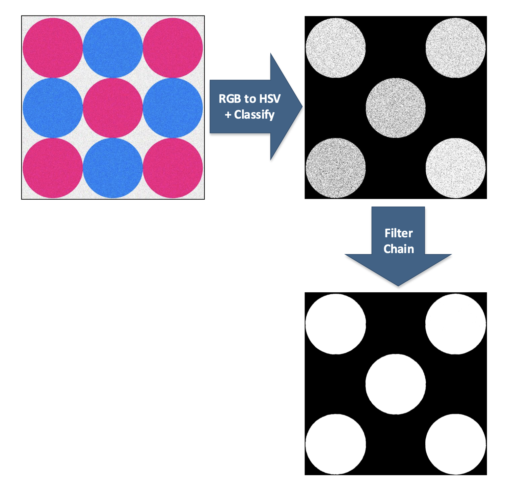
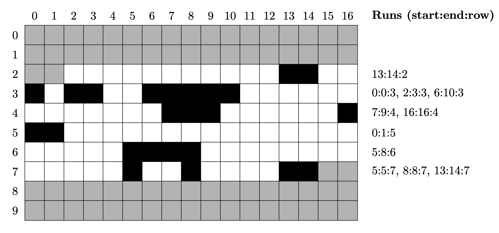

# VHDL Image Filtering

## Project Description ##
This project, focuses on FPGA-based hardware design techniques. 
The first major operation is converting the image from the RGB color space to the HSV color space.
This is done using the RGB2HSV module.
After converting the image to the HSV color space, the next step is to classify the pixels based on their hue and saturation values.
This is done using the Classify module.
The classified pixels are then processed to remove noise and improve the quality of the detected regions.
This is done using the FilterMajor module.
The final step before region detection is run-length encoding.
This is done using the RunLengthEncoder module.

 

### RGB2HSV Module ##
The RGB2HSV component converts RGB pixel data to HSV representation.
This involves using an integer division module for domain conversion calculations, ensuring intermediate values are correctly represented for hardware implementation.

The module performs the following tasks:

1. **Color Space Conversion**: Converts the RGB values of each pixel to HSV values.
2. **Pipeline Stages**: Implements the conversion using multiple pipeline stages to handle intermediate results and ensure efficient processing.

The conversion from RGB to HSV involves the following equations, which are adapted to handle 8-bit integer values used in hardware:

- **Preconditions**: \(R, G, B \in [0, 1]\)
- **MAX**: \( \text{MAX} = \max(R, G, B) \)
- **MIN**: \( \text{MIN} = \min(R, G, B) \)

- **Hue Calculation**:
  \[
  H = \begin{cases} 
  0 & \text{if } \text{MAX} = \text{MIN} \\
  60^\circ \cdot \left(0 + \frac{G - B}{\text{MAX} - \text{MIN}}\right) & \text{if } \text{MAX} = R \\
  60^\circ \cdot \left(2 + \frac{B - R}{\text{MAX} - \text{MIN}}\right) & \text{if } \text{MAX} = G \\
  60^\circ \cdot \left(4 + \frac{R - G}{\text{MAX} - \text{MIN}}\right) & \text{if } \text{MAX} = B 
  \end{cases}
  \]
  If \( H < 0^\circ \), then \( H = H + 360^\circ \)

- **Saturation Calculation**:
  \[
  S = \begin{cases} 
  0 & \text{if } \text{MAX} = 0 \\
  \frac{\text{MAX} - \text{MIN}}{\text{MAX}} & \text{otherwise}
  \end{cases}
  \]

- **Value Calculation**:
  \[
  V = \text{MAX}
  \]

- **Postconditions**: \( H \in [0^\circ, 360^\circ] \) and \( S, V \in [0, 1] \)

### Filter Major Module 
The Filter Major module is a critical component in the image processing chain, responsible for reducing noise in the classified pixel data.
It operates as a noise filter, enhancing the quality of the detected regions by applying a low-pass filter to the pixel data.
This process ensures that only significant regions are detected and small noise artifacts are minimized.

The Filter Major module performs the following tasks:

1. **Noise Filtering**: Applies a convolution operation using a 3x3 kernel to the classified pixel data.
2. **Buffer Management**: Utilizes line buffers to store pixel data from previous lines, enabling the convolution operation.
3. **Pixel Matrix Management**: Maintains a 3x3 pixel matrix to evaluate each pixel based on its surrounding pixels.

#### Noise Filtering implementation

The core of the Filter Major module is the convolution operation, which involves the following steps:

1. **Pixel Evaluation**: For each input pixel, the module evaluates its value based on the values of its surrounding pixels in a 3x3 matrix.
2. **Threshold Application**: A threshold is applied to the 3x3 matrix. If the number of active pixels (value of 1) within the matrix meets or exceeds the threshold, the output pixel is set to active (1). Otherwise, it is set to inactive (0).

#### Line Buffer Implementation

The Filter Major module uses line buffers to store pixel data from previous lines, enabling the 3x3 convolution operation. The implementation involves the following steps:

1. **First-In-First-Out (FIFO) Principle**: The line buffers operate on a FIFO principle, similar to a shift register. This ensures that the pixel data is processed sequentially.
2. **Ring Buffer Principle**: Due to the large size of the image lines, the line buffers are implemented using the ring buffer principle. This approach allows efficient storage and retrieval of pixel data without excessive memory usage.

#### Pixel Matrix Management

The module maintains a 3x3 pixel matrix to perform the convolution operation. The process involves the following steps:

1. **Filling the Matrix**: The pixel matrix is filled with pixel values from the current and previous lines. This requires waiting for enough pixels to fill the matrix initially.
2. **Shifting the Matrix**: As each new pixel is processed, the pixel matrix is shifted to the left. The new pixel is added to the right-most position, and the oldest pixel is discarded.
3. **Convolution Filtering**: The matrix is evaluated to determine the output pixel value based on the threshold.

### Run Length Encoder Module ###
The Run-length Encoder (RLE) processes the black/white pixel data to extract runs, encoding them using start and end positions and the row number.
This component outputs run parameters, including signals indicating new runs and the end of line and file.
The RLE simplifies the implementation of subsequent label selection algorithms by efficiently storing large image areas with the same color.

The RLE module performs the following tasks:

1. **Run Detection**: Identifies continuous sequences (runs) of active pixels (1s) in each row of the input image.
2. **Run Encoding**: Encodes each detected run with its start and end positions along with the row number.
3. **Signal Generation**: Generates signals indicating the detection of new runs, the end of a line (EOL), and the end of the file (EOF).

